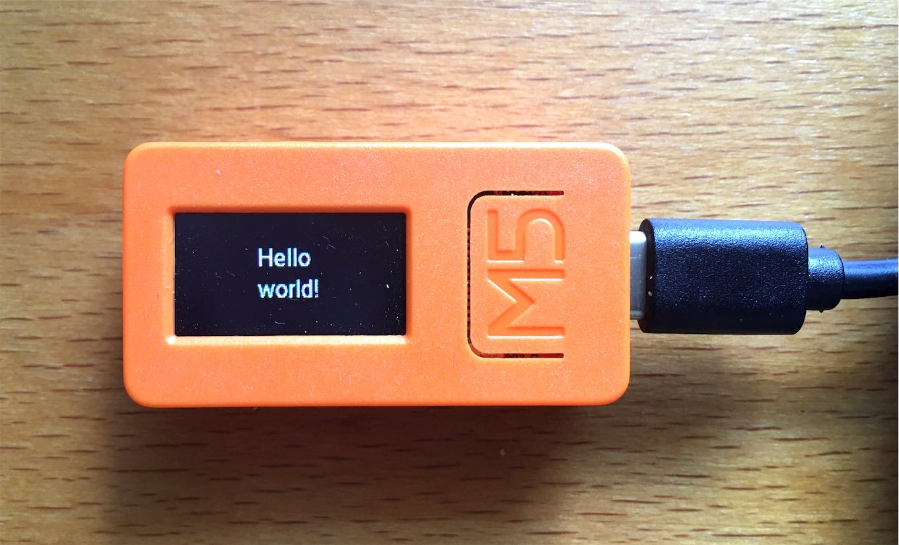

# Preconfigured Kits

### ESP-Wrover-Kit v4.1

This board comes with an embedded TFT screen with the **ILI9341** display driver and it doesn't have touch screen. The screen size is 320 x 240 px.

### M5Stack

This board comes with an embedded TFT screen with the **ILI9341** display driver and it doesn't have touch screen. The screen size is 240 x 320px.

### M5Stick

This board comes with an embedded OLED screen with the SH1107 monochrome display driver and it doesn't have touch screen. The screen size is 128 x 64px.

### M5StickC

This board comes with an embedded OLED screen with the ST7735S color display driver and it doesn't have touch screen. The screen size is 160x80px. This board uses an Power Management IC AXP192, thus you can configure during menuconfig to let LVGL turn on the power or take care on your own by disabling this feature.

### WEMOS LOLIN ESP32 OLED

This board comes with an embedded OLED screen with the SSD1306 monochrome display driver and it doesn't have touch screen. The screen size is 128 x 64px.

## Predefined Board Pinouts

When wiring the display and touchpad (if applicable) it is best to use the board's designated HSPI and VSPI pins to take advantage of the hardware SPI support. Several board configurations are available; select the appropriate board in the "Select predefined board pinouts" menu in `menuconfig` and then wire the display and touchpad accordingly.

## ESP32 Dev Board with 38 GPIOs

### ILI9341 - HSPI
<table>
  <tr>
    <th>MOSI</th>
    <th>CLK</th>
    <th>CS</th>
    <th>DC</th>
    <th>RST</th>
    <th>BCKL</th>
  </tr>
  <tr>
    <td>13</td>
    <td>14</td>
    <td>5</td>
    <td>19</td>
    <td>18</td>
    <td>23</td>
  </tr>
</table>

### XPT2046 - VSPI

<table>
  <tr>
    <th>MOSI</th>
    <th>MISO</th>
    <th>CLK</th>
    <th>CS</th>
    <th>IRQ</th>
  </tr>
  <tr>
    <td>32</td>
    <td>35</td>
    <td>26</td>
    <td>33</td>
    <td>25</td>
  </tr>
</table>

## ESP32 DevKit v1 with 30 GPIOS

There is another development kit with only 30 GPIOs available:

### ILI9341

For ILI9341 HSPI is used, modify the pin configuration in `components/drv/disp_spi.h` to:

### ILI9341 - HSPI
<table>
  <tr>
    <th>MOSI</th>
    <th>CLK</th>
    <th>CS</th>
    <th>DC</th>
    <th>RST</th>
    <th>BCKL</th>
  </tr>
  <tr>
    <td>13</td>
    <td>14</td>
    <td>15</td>
    <td>2</td>
    <td>4</td>
    <td>21</td>
  </tr>
</table>

### XPT2046 - VSPI

<table>
  <tr>
    <th>MOSI</th>
    <th>MISO</th>
    <th>CLK</th>
    <th>CS</th>
    <th>IRQ</th>
  </tr>
  <tr>
    <td>23</td>
    <td>19</td>
    <td>18</td>
    <td>5</td>
    <td>25</td>
  </tr>
</table>

## ESP32 DevKit v4 with 38 GPIOS

See this pdf for further information: https://www.espressif.com/sites/default/files/documentation/esp32-wroom-32d_esp32-wroom-32u_datasheet_en.pdf

### ILI9341 - HSPI
<table>
<tr>
<th>MOSI</th>
<th>CLK</th>
<th>CS</th>
<th>DC</th>
<th>RST</th>
<th>BCKL</th>
</tr>
<tr>
<td>13</td>
<td>14</td>
<td>15</td>
<td>17</td>
<td>25</td>
<td>26</td>
</tr>
</table>

### XPT2046 - VSPI

<table>
<tr>
<th>MOSI</th>
<th>MISO</th>
<th>CLK</th>
<th>CS</th>
<th>IRQ</th>
</tr>
<tr>
<td>23</td>
<td>19</td>
<td>18</td>
<td>5</td>
<td>27</td>
</tr>
</table>

## Sparkfun ESP32 Thing Plus with Adafruit 3.5" 480x320 TFT Featherwing

[Sparkfun ESP32 Thing Plus](https://www.sparkfun.com/products/15663)

[Adafruit 3.5" 480x320 TFT Featherwing](https://www.adafruit.com/product/3651)

The Adafruit Featherwing board uses a HX8357D TFT display controller and a STMPE610 resistive touch controller.  Both are hardwired to the same SPI bus (VSPI).  The STMPE610 is a strange little beast that configures its SPI mode based on the logic levels on MISO and CS during its power-on reset.  The CS signal has a pull-up but the MISO is floating.  It appears that it is usually sampled low (setting SPI Mode 1) but you may find you need a pull-down resistor from MISO to ground.  A 47-kohm resistor will work fine.  The TFT reset and backlight pins are not connected (hardwired on the Featherwing).  There is no touchpad IRQ.  These signals are connected to unused signals in the following configuration.  Note that although I used a Sparkfun ESP32 board, the Adafruit ESP32 featherwing should work identically.

### HX8357D - VSPI
<table>
<tr>
<th>MOSI</th>
<th>CLK</th>
<th>CS</th>
<th>DC</th>
<th>RST</th>
<th>BCKL</th>
</tr>
<tr>
<td>18</td>
<td>5</td>
<td>15</td>
<td>33</td>
<td>4</td>
<td>2</td>
</tr>
</table>

### STMPE610 - VSPI

<table>
<tr>
<th>MOSI</th>
<th>MISO</th>
<th>CLK</th>
<th>CS</th>
<th>IRQ</th>
</tr>
<tr>
<td>18</td>
<td>19</td>
<td>5</td>
<td>32</td>
<td>25</td>
</tr>
</table>

## Other Boards

Of course, all the individual pins can be configured in `menuconfig` if the available predefined options don't match your board or project requirements. By default the predefined options are disabled and pin settings for the 30 pin dev board are defaulted.

### Reference Pinout for the Predefined Boards

As a reference the assigned pins for the predefined boards is given below.

### M5Stack

You can choose between the predefined board for M5Stick, or use the predefined board pinouts, choose SH1107 display controller and configure other options.

<table>
<tr>
<th>MOSI</th>
<th>CLK</th>
<th>CS</th>
<th>DC</th>
<th>RST</th>
<th>BCKL</th>
</tr>
<tr>
<td>23</td>
<td>18</td>
<td>14</td>
<td>27</td>
<td>33</td>
<td>32</td>
</tr>
</table>

### M5Stick 

You can choose between the predefined board for M5Stick, or use the predefined board pinouts, choose SH1107 display controller and configure other options.

<table>
<tr>
<th>MOSI</th>
<th>CLK</th>
<th>CS</th>
<th>DC</th>
<th>RST</th>
</tr>
<tr>
<td>23</td>
<td>18</td>
<td>14</td>
<td>27</td>
<td>33</td>
</tr>
</table>

### WEMOS LOLIN 

You can choose between the predefined board for WEMOS LOLIN, or use the predefined board pinouts, choose SSD1306  display controller and configure other options.

<table>
<tr>
<th>SDA</th>
<th>SCL</th>
</tr>
<tr>
<td>5</td>
<td>4</td>
</tr>
</table>
